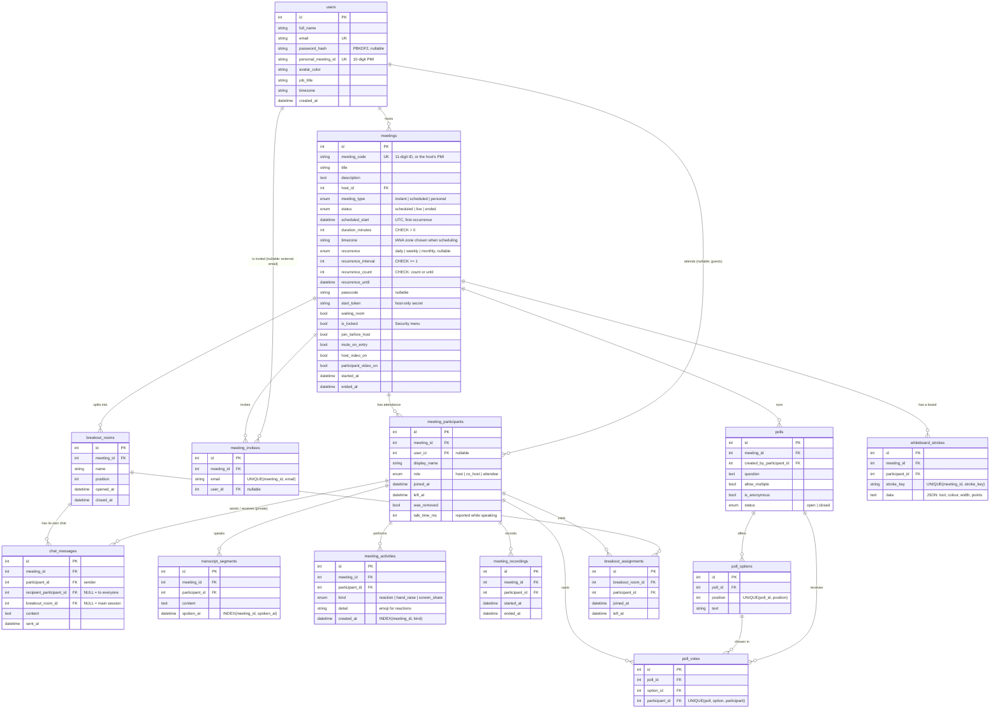

# Zoom Clone: Video Conferencing Platform

A working clone of the **Zoom Workplace** web app. You can start instant meetings, join by Meeting ID or invite link, schedule meetings, and hold real multi-party video calls in the browser, with chat, reactions, screen sharing and host controls.

**Live demo:** _frontend URL_ · **API:** _backend URL_ (the free backend sleeps when idle, so the first load can take about a minute)

| | |
|---|---|
| **Frontend** | Next.js 15 (App Router, single-page client navigation), React 19, TypeScript, Tailwind CSS v4, SWR |
| **Backend** | Python 3.10+, FastAPI, SQLAlchemy 2.0, Pydantic v2, WebSockets |
| **Database** | SQLite (own schema, seeded with sample data) |
| **Real-time media** | WebRTC (peer-to-peer mesh), with signalling over FastAPI WebSockets |

---

## Features

### Core (required)
- **Landing dashboard**: Zoom-style top navigation (Home / Team Chat / Meetings / Contacts, search, settings, profile menu with status). It also has the four action tiles (**New meeting**, **Join**, **Schedule**, **Share screen**), a live clock card listing **upcoming meetings** grouped by day, and a **recent meetings** list.
- **Instant meetings**: one click creates a meeting with a unique 11-digit **Meeting ID** and a passcode, builds a **shareable invite link** (`/j/<id>?pwd=<passcode>`), and redirects the host into the meeting room.
- **Join meeting**: join with a Meeting ID (`845 2931 0472`, `845-2931-0472`) or by pasting the full invite link. You enter a display name before joining, and the Meeting ID is checked against the database before you leave the dashboard. Wrong passcodes are rejected, and attendees wait on a *"Waiting for the host"* screen until the host starts the meeting.
- **Schedule meetings**: topic, description, date and time picker, duration, time zone, attendees (email chips with contact suggestions), passcode, host/participant video defaults, *join anytime* and *mute on entry*. The meeting link is generated automatically and everything is stored in SQLite. Scheduled meetings show up under **Upcoming meetings** and can be edited, deleted, or copied as an invitation.

### In the meeting
- Real **audio/video** between browsers (WebRTC), with a camera/mic **preview** before joining
- **Gallery view** (auto-fitting 16:9 grid) and **Speaker view**, with an **active-speaker** highlight based on live audio levels
- **Screen sharing**, with a large share layout for the other participants
- **Chat**, stored in the database so late joiners see the history
- **Reactions** (👏 👍 ❤️ 😂 😮 🎉) and **Raise hand**
- **Participants panel**, plus an **Invite** dialog with *Copy invite link* and *Copy invitation*
- Microphone and camera **device pickers**, full screen, and a meeting info card
- Automatic **reconnect** after a network hiccup

### Bonus
- **Host controls**: *Mute all*, mute or *ask to unmute* one person, stop someone's video, **remove a participant**, and **end the meeting for everyone**. If the host leaves without ending, host controls pass to the person who has been in the meeting longest, as in Zoom.
- **Responsive layout**: desktop, tablet and mobile (the side panels become full-screen overlays and the toolbar shrinks)
- **Meetings page**: Upcoming / Previous / Personal Room tabs with a details pane. Past meetings have Insights, Participants, Chat, Polls, Transcript and Whiteboard tabs.
- **User authentication (sign up / sign in)**. It's optional, so the brief's "assume a default user" still holds (see *Accounts* below).

### Accounts, recurring meetings and Personal Meeting ID
- **Sign up / Sign in** (`/signup`, `/signin`). Passwords are stored as salted PBKDF2-SHA256 hashes using only the standard library. The session is a signed, 7-day bearer token. **Without signing in you use the demo account**, so nothing in the brief needs a login. Signed-in users see their own meetings, and every account gets a Personal Meeting ID. The seeded accounts can sign in with password `zoom1234`, e.g. `bhavya.talwar@example.com` or `priya.sharma@example.com`.
- **Personal Meeting ID (PMI).** A permanent 10-digit meeting room per user, shown in the profile menu (with *copy link*) and in **Meetings → Personal Room**. It's protected by a waiting room by default. Tick **New meeting ⌄ → Use my Personal Meeting ID** to start it instead of a fresh meeting.
- **Recurring meetings.** *Daily / Weekly / Monthly*, *repeat every N*, ending *after N occurrences* or *by a date*. All occurrences share one Meeting ID and link, as in Zoom. Occurrences are **computed, not stored**, and are generated in the organiser's time zone: "every Monday at 10:00" stays at 10:00 across daylight-saving changes, and a monthly meeting on the 31st falls on the last day of shorter months. Upcoming meetings list each occurrence (with a ⟳ icon), and the details and invitation read like Zoom's (*"Every week on Thu, 8 occurrences"*).

### Zoom meeting controls
- **Waiting room.** Turn it on when scheduling, or live from **Security**. Attendees wait on a *"Please wait, the meeting host will let you in soon"* screen. Hosts get a pop-up with **Admit** and a Waiting Room section in Participants (**Admit**, **Remove**, **Admit all**). Turning the waiting room off admits everyone waiting.
- **Security menu** (host and co-hosts): **Lock Meeting** (new joins are refused), **Enable Waiting Room**, and whether participants may **share their screen, chat, rename themselves or unmute themselves**. The server enforces every one of these, not just the UI.
- **Roles:** **Make Co-Host / Withdraw Co-Host**, **Make Host** (hand the meeting over), **Rename**, **Remove**, **Stop Video**, **Ask to Unmute** (allowed even when self-unmuting is off), **Lower all hands**. Co-hosts can moderate but can't end the meeting or change roles.
- **Spotlight** a video for everyone, or **Pin** one for yourself. **View → Hide Self View / Hide Non-video Participants**.
- **Private chat:** choose *Everyone* or one person in the chat's **To:** picker. Direct messages go only to the two people involved and are never included in the saved history. When the host disables chat, participants can still message the host.
- **Non-verbal feedback** (Yes, No, Slow down, Speed up, I'm away) in the Reactions menu, shown on the person's video and in the participant list.

### Polls, recording and backgrounds
- **Polls.** Hosts and co-hosts create a poll in the **Polls** panel: a question, 2–10 answers, *allow multiple answers*, *anonymous*. Participants get a pop-up to answer (once each). Hosts watch the tallies live, and **End poll and share results** shows everyone the result bars. Polls are stored in the database (`polls`, `poll_options`, `poll_votes`) and appear in the meeting's **Polls** history tab.
- **Record on this computer** (host and co-hosts). The browser draws everyone's video into one canvas (the gallery grid, or the shared screen large with a strip of videos), mixes all audio with the Web Audio API, and records both with `MediaRecorder`. You can pause, resume and stop from the red **Recording…** indicator, and stopping downloads a `.webm` file. Everyone else sees a **Recording** indicator. Each session (who recorded, when, for how long) is saved in `meeting_recordings` and shown in the meeting's insights.
- **Background blur and virtual backgrounds** (**Video ^ → Blur My Background / Choose Virtual Background…**, or **More → Backgrounds & effects**). MediaPipe's selfie-segmentation model runs **on your device**. Each frame, it cuts you out and draws you over a blurred copy of the frame, one of four built-in backgrounds (drawn with the Canvas API), or an image you upload. The processed canvas is sent in place of the camera track, the same way mute and screen share swap tracks. The model is only downloaded the first time you turn on an effect.

### Breakout rooms and whiteboard
- **Breakout rooms** (host). **Create** 1–20 rooms, assigned automatically (round-robin) or by hand, and move anyone with the room pickers, then **Open All Rooms**. Each participant drops their connections to the main session and connects only to the people in their room. Chat, reactions and captions are separate per room too. Participants can **Ask for Help** (the host gets a *Join Room* prompt) or **Leave Room**. The host can visit any room and **broadcast a message** to all rooms. **Close All Rooms** shows a 10-second countdown, then brings everyone back. Every room and every visit is stored (`breakout_rooms`, `breakout_assignments`) and listed in the meeting's history.
- **Whiteboard** (anyone, unless the host has disabled sharing). **Whiteboards** replaces the video stage for everyone with a shared 16:9 board: pen, highlighter, line, rectangle, ellipse, text and eraser, six colours, three widths, undo, clear (whoever opened it or a host) and **Save as PNG**. Pen strokes stream live in 50 ms chunks, and coordinates are stored as fractions of the board so every screen size draws the same picture. Finished strokes are saved (`whiteboard_strokes`), so late joiners see the board and the meeting page has a **Whiteboard** tab.

### Beyond Zoom's basics (novelty)
- **Live captions and a searchable transcript.** The host clicks **Show Captions** to turn captions on for everyone. Each participant's browser transcribes *their own* microphone using the Web Speech API, so every line is attributed to the right speaker and no audio is ever sent to our server. Captions appear over the video. Finished lines are saved to the database as the meeting transcript, which you can view live (**More → View full transcript**) and later search, with highlighted matches, and download as `.txt` from the meeting's page. Speech recognition works in Chrome and Edge; in other browsers you still see everyone else's captions.
- **Meeting insights.** After a meeting, the Insights tab shows its duration, attendance, chat and reaction totals, **talk time per person** (a bar chart with each person's share of speaking time and a hover tooltip), an engagement table (attended time, talk time, messages, reactions, raised hands) and a reaction breakdown. Talk time comes from the same audio-level detection that drives the active-speaker highlight. Reactions, raised hands and screen shares are recorded in an activity log.
- **Keyboard shortcuts and picture-in-picture.** Zoom's shortcuts: **Alt+A** mute, **Alt+V** video, **Alt+S** share, **Alt+H** chat, **Alt+U** participants, **Alt+Y** raise hand, **Alt+C** captions, **Alt+Q** leave. **Hold Space** to talk while muted (push to talk). **More → Keyboard shortcuts** lists them all. **More → Picture-in-picture** pops the active speaker or shared screen into a floating window; recent Chrome versions also do this automatically when you switch tabs.
- **Meeting timer and end-time warning.** Elapsed time is shown in the top bar. Scheduled meetings show *"This meeting is scheduled to end in 5 minutes"* near the end, then a notice once the scheduled time has passed.

---

## Quick start

Prerequisites: **Python 3.10+** and **Node.js 18.18+** (tested with Node 22).

### 1. Backend (FastAPI), http://localhost:8000

```bash
cd backend
python -m venv .venv
# Windows: .venv\Scripts\activate    macOS/Linux: source .venv/bin/activate
pip install -r requirements.txt
cp .env.example .env            # optional, the defaults work locally
uvicorn app.main:app --reload --port 8000
```

On first start the tables are created and **sample data is seeded** automatically. To reset the database:

```bash
python -m app.seed --reset
```

Interactive API docs are at **http://localhost:8000/docs**.

### 2. Frontend (Next.js), http://localhost:3000

```bash
cd frontend
npm install
cp .env.example .env.local      # NEXT_PUBLIC_API_URL=http://localhost:8000
npm run dev
```

### 3. Try a call
You're using the demo account straight away (sign-in is optional). Seeded accounts use password `zoom1234`.

1. Open http://localhost:3000 and click **New meeting**, then **Start**.
2. Open **Participants → Invite → Copy Invite Link**. Paste the link into another browser window, or an incognito window, and join with a different name.
3. Both windows now show each other's video. Try chat, reactions, screen share, and the host's **Mute All**, **Remove** and **End → End meeting for all**.

### Tests

```bash
cd backend
pip install -r requirements-dev.txt
pytest                      # 24 tests: REST + WebSocket

cd ../frontend
npm test                    # 17 unit tests (Vitest)
```

- **Backend:**
  - scheduling, validation and recurrence (daylight saving, month ends, how a series ends)
  - join rules (passcode, waiting for host, host start token, locked meetings) and access control
  - sign-up, sign-in and bearer tokens; the Personal Meeting ID
  - ending abandoned meetings
  - the full WebSocket flow: signalling, chat (private and per breakout room), waiting room, roles and permissions, host handoff, captions and transcript, polls, recording, breakout rooms, whiteboard and insights
- **Frontend:** Meeting ID and invite-link parsing, time-zone conversion, formatting, recurrence descriptions, the invitation text, and the end-of-meeting countdown.
- **Browser end-to-end:** each feature was also run in real headless Chromium, with two or three participants on fake camera and microphone devices. These scripts are not committed.

> There are no migrations. The schema grew as features were added, so if you ran an earlier version, rebuild your local database with `python -m app.seed --reset`.

---

## Deployment

The backend runs on **Render** and the frontend on **Vercel**. Any host that keeps a long-running process and supports WebSockets works for the backend. Serverless functions do not, because they can't hold a WebSocket open.

### Backend on Render

[`render.yaml`](render.yaml) describes the service: **Render → New → Blueprint** and pick this repository. It sets the root directory (`backend`), Python 3.10, the build and start commands, the `/api/health` health check and a generated `SECRET_KEY`.

| Variable | Value |
|---|---|
| `FRONTEND_URL` | The Vercel URL, e.g. `https://zoom-clone.vercel.app`. Invite links are built from it. |
| `CORS_ORIGINS` | The same URL (comma separate several). |
| `SECRET_KEY` | Generated by Render. It signs login and WebSocket tokens. |
| `SEED_ON_STARTUP` | `true`: an empty database is filled with the sample data. |

- **One worker only.** Live meeting rooms (who is connected, waiting room, polls in progress) are kept in the server's memory, so every participant must reach the same process. The start command pins `--workers 1`.
- **SQLite on the free plan** is not persistent: the database is recreated from the seed data after a redeploy or restart. For data that survives, attach a Render disk and set `DATABASE_URL=sqlite:////var/data/zoom_clone.db`.

### Frontend on Vercel

Import the repository, set **Root Directory** to `frontend` (Next.js is detected), and add:

| Variable | Value |
|---|---|
| `NEXT_PUBLIC_API_URL` | The Render URL, e.g. `https://zoom-clone-api.onrender.com`. The WebSocket URL is derived from it (`https` → `wss`). |
| `NEXT_PUBLIC_TURN_URL`, `…_USERNAME`, `…_CREDENTIAL` | Optional TURN server for participants behind strict firewalls. |

`NEXT_PUBLIC_*` values are built into the bundle, so **redeploy** after changing them.

Camera, microphone and screen sharing only work on HTTPS (or localhost), which both hosts provide.

---

## Architecture

```
┌────────────────────────── Browser (Next.js SPA) ───────────────────────────┐
│  Dashboard / Meetings / Join pages ──SWR──►  REST  /api/...                 │
│  Meeting room ── RoomClient ──────────────►  WebSocket  /ws/meetings/{id}   │
│        ▲                                        (signalling + live events)  │
│        └──────────── WebRTC audio/video (peer-to-peer) ────────────► peers  │
└─────────────────────────────────────────────────────────────────────────────┘
┌──────────────────────────────── FastAPI ────────────────────────────────────┐
│ routers/  (thin REST layer) → services/ (business rules) → models/ → SQLite  │
│ realtime/ (WebSocket: in-memory rooms + one handler module per feature)     │
└─────────────────────────────────────────────────────────────────────────────┘
```

### Backend layout (`backend/app`)

| File | Responsibility |
|---|---|
| `main.py` | App factory, CORS, router registration, startup (create tables + seed) |
| `config.py` | Settings from environment variables |
| `database.py` | Engine and session, SQLite foreign keys, `UTCDateTime` column type |
| `models/` | SQLAlchemy schema, one module per area: `user`, `meeting`, `participant`, `engagement` (chat, transcript, activity, recordings), `polls`, `collaboration` (breakout rooms, whiteboard) |
| `schemas.py` | Pydantic request/response models and validation (time zones, emails, passcodes, recurrence) |
| `services/meetings.py` | Business logic: create, schedule, Personal Meeting Room, list upcoming (including recurring occurrences) and recent, join rules, access checks, end, end abandoned meetings |
| `services/recurrence.py` | Computes the occurrences of recurring meetings in the organiser's time zone |
| `services/polls.py` | Poll creation, voting rules and result views |
| `services/insights.py` | Post-meeting insights, computed with `GROUP BY` queries over chat, transcript and activity rows |
| `routers/auth.py`, `routers/meetings.py`, `routers/users.py` | REST endpoints |
| `realtime/socket.py` | WebSocket endpoint: authenticates a participant, admits them or sends them to the waiting room, and passes each message to its handler |
| `realtime/handlers/` | One module per feature (`basics`, `chat`, `moderation`, `polls`, `recording`, `breakout`, `whiteboard`). Each message type is registered with `@on("type", Access.X)`, and `dispatch` checks the sender's role before calling it. |
| `realtime/lifecycle.py` | Admit, waiting room, leave, remove, host handoff, end meeting, and the sweeper that ends abandoned meetings |
| `realtime/state.py`, `realtime/store.py` | In-memory room state (peers, waiting room, security, groups), and database helpers run in a thread pool |
| `security.py` | Meeting ID / PMI / passcode generation, password hashing, signed session and WebSocket tokens |
| `seed.py` | Sample users and meetings, generated relative to "now" |

### Frontend layout (`frontend/src`)

| Path | Responsibility |
|---|---|
| `app/(workspace)/` | Pages that share the top navigation: Home, Meetings, Contacts, Team Chat |
| `app/j/[code]/` | Invite link and meeting room route |
| `app/join/`, `app/signin/`, `app/signup/` | Standalone "Join Meeting", sign-in and sign-up pages |
| `components/polls/`, `components/breakout/`, `components/whiteboard/` | Polls panel and results, breakout rooms panel and banners, interactive and read-only whiteboard |
| `lib/recording/`, `lib/rtc/background-processor.ts`, `lib/whiteboard/` | Meeting recorder, on-device background effects, whiteboard rendering and hit-testing |
| `components/ui/` | Reusable primitives: Button, Modal, Popover, Avatar, Field, Checkbox/Switch, Toast |
| `components/home/`, `components/meetings/` | Dashboard cards, schedule/join dialogs, meeting details |
| `components/room/` | Pre-join, meeting room, video stage/tiles, toolbar, participants/chat/transcript panels, captions overlay, timer |
| `components/meetings/InsightsView.tsx` | Post-meeting insights: stat tiles, talk-time chart, engagement table |
| `components/transcript/` | Searchable, downloadable transcript, shared by the meeting room and the meeting page |
| `lib/rtc/room-client.ts` | **All WebRTC and WebSocket logic**, independent of React |
| `lib/api.ts`, `lib/types.ts` | Typed API client that mirrors the backend schemas |
| `lib/meeting-time.ts` | Meeting timer and end-of-meeting countdown (pure functions, unit tested) |
| `hooks/` | SWR data hooks, camera preview, active speaker and talk time, speech captions, keyboard shortcuts, picture-in-picture, local settings |

---

## Database design



**Design decisions**
- **Meeting vs. participant.** A `meetings` row is the thing you schedule. It owns the ID, passcode and settings. A `meeting_participants` row is one *attendance* (join → leave). This one table gives the live roster, the "Recent meetings" history (who attended, for how long) and the audit trail for removed participants.
- **Public ID vs. primary key.** URLs use the random 11-digit `meeting_code`, never the auto-increment `id`, so meetings can't be enumerated. The code is unique and indexed.
- **Invite links are derived, not stored.** `join_url` is built from `FRONTEND_URL + meeting_code + passcode` when the API responds. Storing it would leave stale links if the domain changes.
- **Guests are first-class.** `user_id` is nullable on participants and invitees, so people without an account (invite-link guests, external emails) are still recorded. Invitees whose email matches a user are linked, which is how meetings you're invited to appear on *your* dashboard.
- **Integrity in the database.** Foreign keys use `ON DELETE CASCADE` (SQLite's `PRAGMA foreign_keys` is turned on for every connection). `CHECK` constraints enforce a positive duration, require a start time on scheduled meetings, and require every recurring series to end (by count or date). `UNIQUE` constraints stop double votes and duplicate poll options. A `UNIQUE(meeting_id, email)` constraint prevents duplicate invites. Composite indexes cover the dashboard queries (`host_id, scheduled_start`) and live-roster lookups (`meeting_id, left_at`).
- **Time.** All timestamps are stored in UTC through a custom `UTCDateTime` type, which gives back timezone-aware values and so serialises with `Z`. The organiser's IANA `timezone` is kept so an edit shows the original wall-clock time. The schedule form sends a local time plus a time zone, and the server converts it with `zoneinfo`.
- **Recurring meetings are one row.** A series keeps one Meeting ID and link (as in Zoom). Its occurrences are computed from `recurrence`, `recurrence_interval` and `recurrence_count` / `recurrence_until` rather than stored as copies, so editing the series edits every future occurrence.
- **Polls are normalised.** `polls → poll_options → poll_votes`, with one row per chosen option, so single and multiple choice use the same tables, and tallies are a `GROUP BY`.
- **Enums** are stored as readable strings (`'live'`, `'scheduled'`) rather than integers.
- **Everything that happens in a meeting hangs off the participant who did it.** Chat messages, transcript lines and activities all reference `meeting_participants`, so insights come from `GROUP BY participant_id` queries rather than stored totals. `meeting_activities` is an append-only event log (kind + detail + time). New kinds of engagement can be added without new tables, and the totals can always be recomputed. The one stored aggregate is `talk_time_ms`: speaking time arrives as a stream of small increments, and a row per 250 ms sample would be wasteful.

---

## API

| Method & path | Purpose |
|---|---|
| `POST /api/auth/signup` / `POST /api/auth/login` | Create an account / sign in. Returns a bearer token |
| `GET /api/users/me` | The signed-in user, or the demo user without a token |
| `GET /api/users` | Contacts, used for attendee suggestions |
| `GET /api/meetings?scope=upcoming\|recent` | Dashboard lists |
| `POST /api/meetings/instant` | Create an instant meeting (`use_pmi` starts the Personal Meeting Room) |
| `GET /api/meetings/personal` | My Personal Meeting Room |
| `POST /api/meetings` | Schedule a meeting |
| `GET /api/meetings/{id}` | Meeting details (`start_token` only for the host) |
| `PUT /api/meetings/{id}` / `DELETE /api/meetings/{id}` | Edit / delete (host only) |
| `GET /api/meetings/{id}/lookup` | Public check that a meeting exists (join flow) |
| `POST /api/meetings/{id}/join` | Checks the passcode / host start token / waiting-for-host rule, records the participant, returns a signed WebSocket token |
| `GET /api/meetings/{id}/participants` / `messages` / `transcript` | Attendance, chat history, transcript |
| `GET /api/meetings/{id}/insights` | Post-meeting insights (talk time, engagement, reactions, polls, recordings) |
| `GET /api/meetings/{id}/polls` / `breakouts` / `whiteboard` | Poll results, breakout rooms and who was in them, saved whiteboard |
| `WS /ws/meetings/{id}?token=…` | Signalling and live meeting events |

Errors use one shape, `{"detail": {"code": "WAITING_FOR_HOST", "message": "…"}}`, so the UI can branch on `code`.

**Access control.** Only people involved in a meeting (host, invitee or attendee) can see its details, passcode, attendance, chat, transcript and insights. Everyone else gets `403 FORBIDDEN`. The public `lookup` endpoint confirms a Meeting ID exists but never reveals the passcode, so knowing an ID is not enough to get in.

### How a call works
1. `POST /join` returns an HMAC-signed token tied to the participant and meeting.
2. The browser opens the WebSocket. The server replies with `welcome` (current peers and chat history) and tells everyone else `peer-joined`.
3. **The newcomer sends an SDP offer to each existing peer**, and they answer. Because only the newcomer offers, two peers never offer to each other at the same time.
4. Each connection starts with one audio and one video transceiver. Muting, turning the camera off, switching devices and screen sharing are all a `replaceTrack`, so no renegotiation is ever needed.
5. The server relays `signal` messages by participant id and never touches the media. Chat, reactions, captions, talk time, mic/camera state and host commands go over the same socket. The server checks host commands against the participant's role.
6. Each browser handles incoming messages **strictly one at a time, in order**. Several steps wait on WebRTC calls, and letting them overlap (for example a `peer-left` arriving while that peer's offer is still being processed) would act on a connection that had already been closed.
7. If the host disconnects without ending the meeting, the participant who joined earliest is promoted (`host-changed`), both in memory and in the database.
8. When the last person leaves, the meeting is marked `ended` after a short grace period, so a page refresh doesn't end it. A background sweep also ends "live" meetings nobody is connected to: for example, when a tab closed between the join request and the WebSocket connecting, or after a server restart.

---

## Assumptions and scope

- **Login is optional.** As the brief allows, every request without a session acts as one seeded default user (`Bhavya Talwar`, set by `DEFAULT_USER_EMAIL`). Signing in (the bonus feature) switches to that account's meetings. The *host* inside a meeting is whoever opens it through the dashboard's **Start** button, which carries the meeting's `start_token` (like Zoom's start URL). Anyone opening the plain invite link joins as an attendee, so host and attendee can be tried from two browser windows.
- **Passcodes.** Invite links include the passcode (as Zoom's do). Joining by ID alone asks for it.
- **Media topology.** WebRTC **mesh**: every participant connects to every other one. This works well for small meetings (about 6 people). Larger meetings would need an SFU (e.g. LiveKit or mediasoup).
- **NAT traversal.** Public Google STUN servers are used. Networks with strict NATs or firewalls need a TURN server, which can be set with `NEXT_PUBLIC_TURN_URL`, `NEXT_PUBLIC_TURN_USERNAME` and `NEXT_PUBLIC_TURN_CREDENTIAL`.
- **Single backend process.** Live room state (who is connected) is kept in memory, so the API must run as one worker. Scaling out would move it to Redis pub/sub.
- **Recording is local**, like Zoom's *Record on this computer*. Cloud recording would need a media server. **Background effects** download MediaPipe's WebAssembly runtime (jsDelivr) and model (Google storage) on first use.
- **Camera and microphone need a secure context.** Browsers only allow them on `https://` or `localhost`.
- **Captions.** Speech recognition uses the browser's built-in Web Speech API (Chrome and Edge; Chrome uses Google's speech service). If you test with two tabs on one computer, both tabs hear the same microphone, so captions appear twice. Talk time is measured by each participant's own browser and reported to the server.
- Zoom's look is recreated with its public colours, layout and interaction patterns. No Zoom assets or trademarked logos are included, and the wordmark is plain styled text.

---

## Project structure

```
Zoom-Clone/
├── backend/
│   ├── app/            FastAPI application (see table above)
│   ├── tests/          pytest suite (REST + WebSocket)
│   ├── requirements.txt
│   └── .env.example
├── frontend/
│   ├── src/app/        Next.js routes
│   ├── src/components/ UI primitives, dashboard, meeting room
│   ├── src/hooks/      data, media, and settings hooks
│   ├── src/lib/        API client, types, formatting, WebRTC RoomClient
│   └── .env.example
└── render.yaml         Render Blueprint for the backend
```
