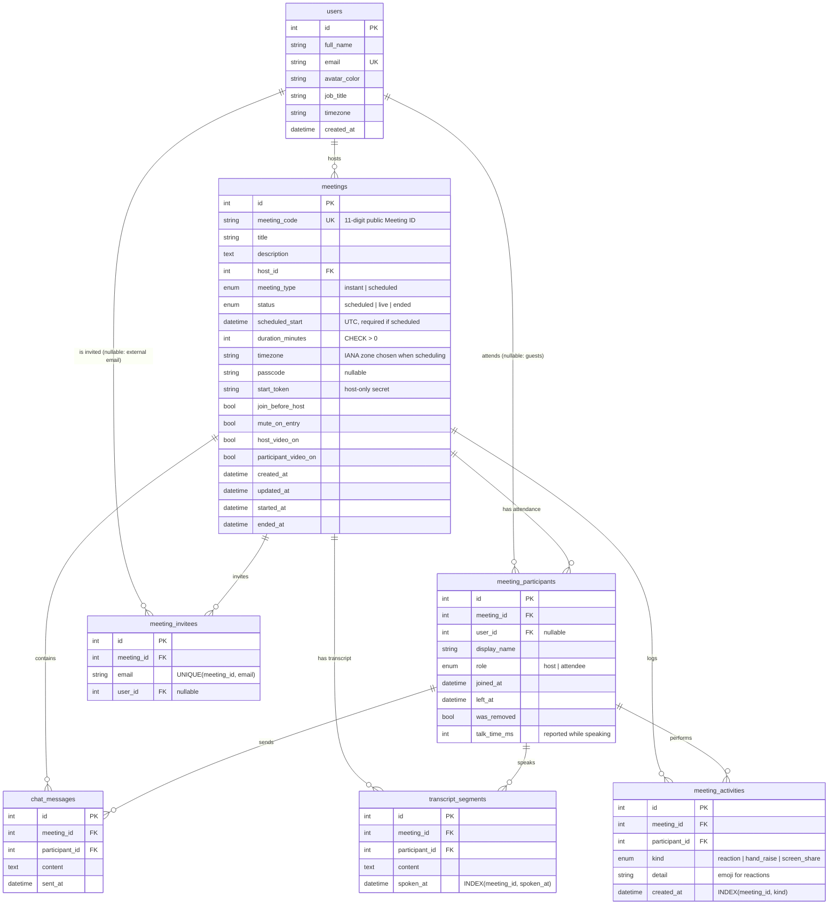

# Zoom Clone: Video Conferencing Platform

A working clone of the **Zoom Workplace** web app. You can start instant meetings, join by Meeting ID or invite link, schedule meetings, and hold real multi-party video calls in the browser, with chat, reactions, screen sharing and host controls.

| | |
|---|---|
| **Frontend** | Next.js 15 (App Router, single-page client navigation), React 19, TypeScript, Tailwind CSS v4, SWR |
| **Backend** | Python 3.10+, FastAPI, SQLAlchemy 2.0, Pydantic v2, WebSockets |
| **Database** | SQLite (own schema, seeded with sample data) |
| **Real-time media** | WebRTC (peer-to-peer mesh), with signalling over FastAPI WebSockets |

---

## Features

### Core (required)
- **Landing dashboard**: Zoom-style top navigation (Home / Team Chat / Meetings / Contacts, search, settings, profile menu with status). It also has the four action tiles (**New meeting**, **Join**, **Schedule**, **Share screen**), a live clock card listing **upcoming meetings** grouped by day, and a **recent meetings** list.
- **Instant meetings**: one click creates a meeting with a unique 11-digit **Meeting ID** and a passcode, builds a **shareable invite link** (`/j/<id>?pwd=<passcode>`), and redirects the host into the meeting room.
- **Join meeting**: join with a Meeting ID (`845 2931 0472`, `845-2931-0472`) or by pasting the full invite link. You enter a display name before joining, and the Meeting ID is checked against the database before you leave the dashboard. Wrong passcodes are rejected, and attendees wait on a *"Waiting for the host"* screen until the host starts the meeting.
- **Schedule meetings**: topic, description, date and time picker, duration, time zone, attendees (email chips with contact suggestions), passcode, host/participant video defaults, *join anytime* and *mute on entry*. The meeting link is generated automatically and everything is stored in SQLite. Scheduled meetings show up under **Upcoming meetings** and can be edited, deleted, or copied as an invitation.

### In the meeting
- Real **audio/video** between browsers (WebRTC), with a camera/mic **preview** before joining
- **Gallery view** (auto-fitting 16:9 grid) and **Speaker view**, with an **active-speaker** highlight based on live audio levels
- **Screen sharing**, with a large share layout for the other participants
- **Chat**, stored in the database so late joiners see the history
- **Reactions** (👏 👍 ❤️ 😂 😮 🎉) and **Raise hand**
- **Participants panel**, plus an **Invite** dialog with *Copy invite link* and *Copy invitation*
- Microphone and camera **device pickers**, full screen, and a meeting info card
- Automatic **reconnect** after a network hiccup

### Bonus
- **Host controls**: *Mute all*, mute or *ask to unmute* one person, stop someone's video, **remove a participant**, and **end the meeting for everyone**. If the host leaves without ending, host controls pass to the person who has been in the meeting longest, as in Zoom.
- **Responsive layout**: desktop, tablet and mobile (the side panels become full-screen overlays and the toolbar shrinks)
- **Meetings page**: Upcoming / Previous tabs with a details pane. Past meetings have Insights, Participants, Chat and Transcript tabs.

### Beyond Zoom's basics (novelty)
- **Live captions and a searchable transcript.** The host clicks **Show Captions** to turn captions on for everyone. Each participant's browser transcribes *their own* microphone using the Web Speech API, so every line is attributed to the right speaker and no audio is ever sent to our server. Captions appear over the video. Finished lines are saved to the database as the meeting transcript, which you can view live (**More → View full transcript**) and later search, with highlighted matches, and download as `.txt` from the meeting's page. Speech recognition works in Chrome and Edge; in other browsers you still see everyone else's captions.
- **Meeting insights.** After a meeting, the Insights tab shows its duration, attendance, chat and reaction totals, **talk time per person** (a bar chart with each person's share of speaking time and a hover tooltip), an engagement table (attended time, talk time, messages, reactions, raised hands) and a reaction breakdown. Talk time comes from the same audio-level detection that drives the active-speaker highlight. Reactions, raised hands and screen shares are recorded in an activity log.
- **Keyboard shortcuts and picture-in-picture.** Zoom's shortcuts: **Alt+A** mute, **Alt+V** video, **Alt+S** share, **Alt+H** chat, **Alt+U** participants, **Alt+Y** raise hand, **Alt+C** captions, **Alt+Q** leave. **Hold Space** to talk while muted (push to talk). **More → Keyboard shortcuts** lists them all. **More → Picture-in-picture** pops the active speaker or shared screen into a floating window; recent Chrome versions also do this automatically when you switch tabs.
- **Meeting timer and end-time warning.** Elapsed time is shown in the top bar. Scheduled meetings show *"This meeting is scheduled to end in 5 minutes"* near the end, then a notice once the scheduled time has passed.

---

## Quick start

Prerequisites: **Python 3.10+** and **Node.js 18.18+** (tested with Node 22).

### 1. Backend (FastAPI), http://localhost:8000

```bash
cd backend
python -m venv .venv
# Windows: .venv\Scripts\activate    macOS/Linux: source .venv/bin/activate
pip install -r requirements.txt
cp .env.example .env            # optional, the defaults work locally
uvicorn app.main:app --reload --port 8000
```

On first start the tables are created and **sample data is seeded** automatically. To reset the database:

```bash
python -m app.seed --reset
```

Interactive API docs are at **http://localhost:8000/docs**.

### 2. Frontend (Next.js), http://localhost:3000

```bash
cd frontend
npm install
cp .env.example .env.local      # NEXT_PUBLIC_API_URL=http://localhost:8000
npm run dev
```

### 3. Try a call
1. Open http://localhost:3000 and click **New meeting**, then **Start**.
2. Open **Participants → Invite → Copy Invite Link**. Paste the link into another browser window, or an incognito window, and join with a different name.
3. Both windows now show each other's video. Try chat, reactions, screen share, and the host's **Mute All**, **Remove** and **End → End meeting for all**.

### Tests

```bash
cd backend
pip install -r requirements-dev.txt
pytest                      # 12 tests: REST + WebSocket

cd ../frontend
npm test                    # 15 unit tests (Vitest)
```

- **Backend:** scheduling and validation; the join rules (passcode, waiting for host, host start token); access control on meeting details; ending abandoned meetings; and the full WebSocket flow (signalling relay, chat persistence, host-only actions, remove, end meeting, host handoff, captions/transcript, talk time and insights).
- **Frontend:** Meeting ID and invite-link parsing, time-zone conversion, formatting, the invitation text, and the end-of-meeting countdown logic.

> The schema changed when captions and insights were added. There are no migrations, so if you ran an earlier version, rebuild your local database with `python -m app.seed --reset`.

---

## Architecture

```
┌────────────────────────── Browser (Next.js SPA) ───────────────────────────┐
│  Dashboard / Meetings / Join pages ──SWR──►  REST  /api/...                 │
│  Meeting room ── RoomClient ──────────────►  WebSocket  /ws/meetings/{id}   │
│        ▲                                        (signalling + live events)  │
│        └──────────── WebRTC audio/video (peer-to-peer) ────────────► peers  │
└─────────────────────────────────────────────────────────────────────────────┘
┌──────────────────────────────── FastAPI ────────────────────────────────────┐
│ routers/  (thin HTTP/WS layer) → services/meetings.py (business rules)      │
│ services/rooms.py (in-memory room registry) → SQLAlchemy models → SQLite    │
└─────────────────────────────────────────────────────────────────────────────┘
```

### Backend layout (`backend/app`)

| File | Responsibility |
|---|---|
| `main.py` | App factory, CORS, router registration, startup (create tables + seed) |
| `config.py` | Settings from environment variables |
| `database.py` | Engine and session, SQLite foreign keys, `UTCDateTime` column type |
| `models.py` | SQLAlchemy schema (see below) |
| `schemas.py` | Pydantic request/response models and validation (time zones, emails, passcodes) |
| `services/meetings.py` | Business logic: create, schedule, list upcoming/recent, join rules, access checks, end, end abandoned meetings |
| `services/insights.py` | Post-meeting insights, computed with `GROUP BY` queries over chat, transcript and activity rows |
| `services/rooms.py` | Who is connected to which room (in memory), join order, captions on/off |
| `routers/meetings.py`, `routers/users.py` | REST endpoints |
| `routers/realtime.py` | WebSocket endpoint: signalling relay, chat, reactions, captions, talk time, host actions, host handoff, and the background sweeper that ends abandoned meetings |
| `security.py` | Meeting ID / passcode / token generation, HMAC-signed WebSocket tokens |
| `seed.py` | Sample users and meetings, generated relative to "now" |

### Frontend layout (`frontend/src`)

| Path | Responsibility |
|---|---|
| `app/(workspace)/` | Pages that share the top navigation: Home, Meetings, Contacts, Team Chat |
| `app/j/[code]/` | Invite link and meeting room route |
| `app/join/` | Standalone "Join Meeting" page |
| `components/ui/` | Reusable primitives: Button, Modal, Popover, Avatar, Field, Checkbox/Switch, Toast |
| `components/home/`, `components/meetings/` | Dashboard cards, schedule/join dialogs, meeting details |
| `components/room/` | Pre-join, meeting room, video stage/tiles, toolbar, participants/chat/transcript panels, captions overlay, timer |
| `components/meetings/InsightsView.tsx` | Post-meeting insights: stat tiles, talk-time chart, engagement table |
| `components/transcript/` | Searchable, downloadable transcript, shared by the meeting room and the meeting page |
| `lib/rtc/room-client.ts` | **All WebRTC and WebSocket logic**, independent of React |
| `lib/api.ts`, `lib/types.ts` | Typed API client that mirrors the backend schemas |
| `lib/meeting-time.ts` | Meeting timer and end-of-meeting countdown (pure functions, unit tested) |
| `hooks/` | SWR data hooks, camera preview, active speaker and talk time, speech captions, keyboard shortcuts, picture-in-picture, local settings |

---

## Database design



**Design decisions**
- **Meeting vs. participant.** A `meetings` row is the thing you schedule. It owns the ID, passcode and settings. A `meeting_participants` row is one *attendance* (join → leave). This one table gives the live roster, the "Recent meetings" history (who attended, for how long) and the audit trail for removed participants.
- **Public ID vs. primary key.** URLs use the random 11-digit `meeting_code`, never the auto-increment `id`, so meetings can't be enumerated. The code is unique and indexed.
- **Invite links are derived, not stored.** `join_url` is built from `FRONTEND_URL + meeting_code + passcode` when the API responds. Storing it would leave stale links if the domain changes.
- **Guests are first-class.** `user_id` is nullable on participants and invitees, so people without an account (invite-link guests, external emails) are still recorded. Invitees whose email matches a user are linked, which is how meetings you're invited to appear on *your* dashboard.
- **Integrity in the database.** Foreign keys use `ON DELETE CASCADE` (SQLite's `PRAGMA foreign_keys` is turned on for every connection). `CHECK` constraints enforce a positive duration and require a start time on scheduled meetings. A `UNIQUE(meeting_id, email)` constraint prevents duplicate invites. Composite indexes cover the dashboard queries (`host_id, scheduled_start`) and live-roster lookups (`meeting_id, left_at`).
- **Time.** All timestamps are stored in UTC through a custom `UTCDateTime` type, which gives back timezone-aware values and so serialises with `Z`. The organiser's IANA `timezone` is kept so an edit shows the original wall-clock time. The schedule form sends a local time plus a time zone, and the server converts it with `zoneinfo`.
- **Enums** are stored as readable strings (`'live'`, `'scheduled'`) rather than integers.
- **Everything that happens in a meeting hangs off the participant who did it.** Chat messages, transcript lines and activities all reference `meeting_participants`, so insights come from `GROUP BY participant_id` queries rather than stored totals. `meeting_activities` is an append-only event log (kind + detail + time). New kinds of engagement can be added without new tables, and the totals can always be recomputed. The one stored aggregate is `talk_time_ms`: speaking time arrives as a stream of small increments, and a row per 250 ms sample would be wasteful.

---

## API

| Method & path | Purpose |
|---|---|
| `GET /api/users/me` | The logged-in (default) user |
| `GET /api/users` | Contacts, used for attendee suggestions |
| `GET /api/meetings?scope=upcoming\|recent` | Dashboard lists |
| `POST /api/meetings/instant` | Create an instant meeting |
| `POST /api/meetings` | Schedule a meeting |
| `GET /api/meetings/{id}` | Meeting details (`start_token` only for the host) |
| `PUT /api/meetings/{id}` / `DELETE /api/meetings/{id}` | Edit / delete (host only) |
| `GET /api/meetings/{id}/lookup` | Public check that a meeting exists (join flow) |
| `POST /api/meetings/{id}/join` | Checks the passcode / host start token / waiting-for-host rule, records the participant, returns a signed WebSocket token |
| `GET /api/meetings/{id}/participants` / `messages` / `transcript` | Attendance, chat history, transcript |
| `GET /api/meetings/{id}/insights` | Post-meeting insights (talk time, engagement, reactions) |
| `WS /ws/meetings/{id}?token=…` | Signalling and live meeting events |

Errors use one shape, `{"detail": {"code": "WAITING_FOR_HOST", "message": "…"}}`, so the UI can branch on `code`.

**Access control.** Only people involved in a meeting (host, invitee or attendee) can see its details, passcode, attendance, chat, transcript and insights. Everyone else gets `403 FORBIDDEN`. The public `lookup` endpoint confirms a Meeting ID exists but never reveals the passcode, so knowing an ID is not enough to get in.

### How a call works
1. `POST /join` returns an HMAC-signed token tied to the participant and meeting.
2. The browser opens the WebSocket. The server replies with `welcome` (current peers and chat history) and tells everyone else `peer-joined`.
3. **The newcomer sends an SDP offer to each existing peer**, and they answer. Because only the newcomer offers, two peers never offer to each other at the same time.
4. Each connection starts with one audio and one video transceiver. Muting, turning the camera off, switching devices and screen sharing are all a `replaceTrack`, so no renegotiation is ever needed.
5. The server relays `signal` messages by participant id and never touches the media. Chat, reactions, captions, talk time, mic/camera state and host commands go over the same socket. The server checks host commands against the participant's role.
6. Each browser handles incoming messages **strictly one at a time, in order**. Several steps wait on WebRTC calls, and letting them overlap (for example a `peer-left` arriving while that peer's offer is still being processed) would act on a connection that had already been closed.
7. If the host disconnects without ending the meeting, the participant who joined earliest is promoted (`host-changed`), both in memory and in the database.
8. When the last person leaves, the meeting is marked `ended` after a short grace period, so a page refresh doesn't end it. A background sweep also ends "live" meetings nobody is connected to: for example, when a tab closed between the join request and the WebSocket connecting, or after a server restart.

---

## Assumptions and scope

- **No login.** As the brief allows, every request acts as one seeded default user (`Bhavya Talwar`, set by `DEFAULT_USER_EMAIL`). The *host* inside a meeting is whoever opens it through the dashboard's **Start** button, which carries the meeting's `start_token` (like Zoom's start URL). Anyone opening the plain invite link joins as an attendee, so host and attendee can be tried from two browser windows.
- **Passcodes.** Invite links include the passcode (as Zoom's do). Joining by ID alone asks for it.
- **Media topology.** WebRTC **mesh**: every participant connects to every other one. This works well for small meetings (about 6 people). Larger meetings would need an SFU (e.g. LiveKit or mediasoup).
- **NAT traversal.** Public Google STUN servers are used. Networks with strict NATs or firewalls need a TURN server, which can be set with `NEXT_PUBLIC_TURN_URL`, `NEXT_PUBLIC_TURN_USERNAME` and `NEXT_PUBLIC_TURN_CREDENTIAL`.
- **Single backend process.** Live room state (who is connected) is kept in memory, so the API must run as one worker. Scaling out would move it to Redis pub/sub.
- **Not implemented:** cloud recording (the button shows a notice), persistent Team Chat, whiteboards, waiting room, breakout rooms and recurring meetings.
- **Camera and microphone need a secure context.** Browsers only allow them on `https://` or `localhost`.
- **Captions.** Speech recognition uses the browser's built-in Web Speech API (Chrome and Edge; Chrome uses Google's speech service). If you test with two tabs on one computer, both tabs hear the same microphone, so captions appear twice. Talk time is measured by each participant's own browser and reported to the server.
- Zoom's look is recreated with its public colours, layout and interaction patterns. No Zoom assets or trademarked logos are included, and the wordmark is plain styled text.

---

## Project structure

```
Zoom-Clone/
├── backend/
│   ├── app/            FastAPI application (see table above)
│   ├── tests/          pytest suite (REST + WebSocket)
│   ├── requirements.txt
│   └── .env.example
└── frontend/
    ├── src/app/        Next.js routes
    ├── src/components/ UI primitives, dashboard, meeting room
    ├── src/hooks/      data, media, and settings hooks
    ├── src/lib/        API client, types, formatting, WebRTC RoomClient
    └── .env.example
```
